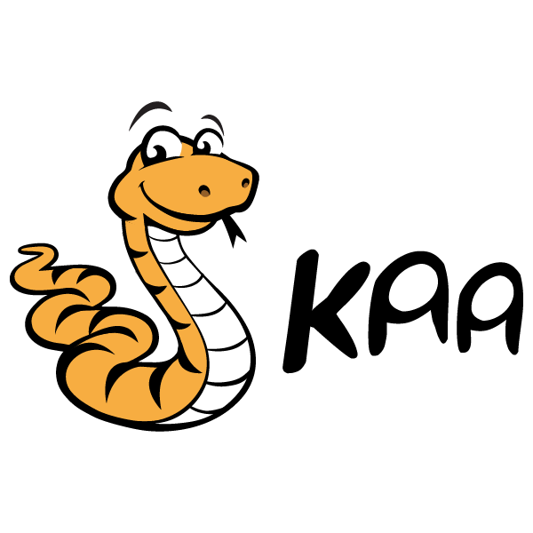

Kaa open-source IoT platform
============================

Welcome to Kaa!

Kaa is an open-source middleware platform for building, managing, and integrating connected products with the Internet of Everything.

    

### Kaa in a nutshell

Kaa is a highly flexible open-source platform for building, managing, and integrating applications in the Internet of Things. Kaa offers a holistic approach for implementing rich communication, control, and interoperation capabilities into connected products and smart devices. On top of this, powerful back-end functionality of Kaa greatly speeds up IoT product development, allowing vendors to concentrate on maximizing their product’s unique value to the consumer.

Key features of Kaa are:

* **[Events](http://docs.kaaproject.org/display/KAA/Events)**: Kaa provides a mechanism for delivery of configurable event messages across connected devices.
* **[Data collection](http://docs.kaaproject.org/display/KAA/Logging)**: The Kaa Logging subsystem is responsiblefor temporary storage of data records ("logs") on the endpoints, periodically transferring these logs from endpoints to servers, and, finally, either persisting them on the server for further processing or submitting them to immediate stream analysis.
* **[Profiling](http://docs.kaaproject.org/display/KAA/Endpoint+profiling) and [grouping](http://docs.kaaproject.org/display/KAA/Endpoint+grouping)**: Kaa introduces the concept of the endpoint profile which consists of client-side and server-side parts. Profiles can then be used to organize the endpoints into groups. Endpoint groups can be used, for example, to send targeted notifications or adjust software behavior.
* **[Notifications delivery](http://docs.kaaproject.org/display/KAA/Notifications)**: Kaa features a topic-based notification system that allows the server to deliver messages of any predefined structure to subscribed endpoints.
* **[Data distribution](http://docs.kaaproject.org/display/KAA/Configuration)**: Kaa allows performing updates of operational data, such as configuration data, from the Kaa server to endpoints.
* **[Transport abstraction](http://docs.kaaproject.org/display/KAA/Transports)**: Kaa’s data channel abstraction architecture presents software vendors with freedom in selecting a networking stack for establishing communication between the server and endpoints - WiFi, Ethernet, Zigbee, mqtt, CoAP, XMPP, TCP, HTTP, etc.
* **[Support of multi-tenancy and multi-application configuration](http://docs.kaaproject.org/display/KAA/Design+reference)**: The Kaa server is able to serve multiple business entities and multiple applications independently on a single server instance.

### Resources

* [Kaa website](http://www.kaaproject.org/)
* [Project wiki](http://docs.kaaproject.org/display/KAA/)
* [Task tracker](http://jira.kaaproject.org/browse/KAA/)
* [Google group](https://groups.google.com/forum/#!forum/kaaproject)

# Getting started

Kaa Sandbox is the quickest and easiest way to get started with Kaa. It's a private Kaa environment which includes demo client applications. Kaa Sandbox includes all necessary Kaa components in a convenient virtual environment that can be set up in just 5 minutes! Checkout [Getting started](http://docs.kaaproject.org/display/KAA/Getting+started) page for more information.

### Installation and configuration

After you get acquainted with Kaa Sandbox and its demo applications, you can take one step further and install Kaa into your environment. Kaa installation is available in the single node mode or in the distributed mode, as described in the [Installation guide](http://docs.kaaproject.org/display/KAA/Installation+guide).

### Supported platforms

Operating systems:

* [Android](http://docs.kaaproject.org/display/KAA/Android)
* [iOS](http://docs.kaaproject.org/display/KAA/iOS)
* [Linux](http://docs.kaaproject.org/display/KAA/Linux)
* [Snappy Ubuntu](http://docs.kaaproject.org/display/KAA/Snappy+Ubuntu+Core)
* [Windows](http://docs.kaaproject.org/display/KAA/Windows)
* [QNX](http://docs.kaaproject.org/display/KAA/QNX+Neutrino+RTOS)

Hardware platforms:

* [Intel Edison](http://docs.kaaproject.org/display/KAA/Intel+Edison)
* [BeagleBone](http://docs.kaaproject.org/display/KAA/BeagleBone)
* [Raspberry Pi](http://docs.kaaproject.org/display/KAA/Raspberry+Pi)
* [Econais](http://docs.kaaproject.org/display/KAA/Econais)
* [Texas Instruments CC3200](http://docs.kaaproject.org/display/KAA/Texas+Instruments+CC3200)
* [ESP8266](http://docs.kaaproject.org/display/KAA/ESP8266)

Supported data processing systems

* [Hadop]()
* [MongoDB]()
* [Oracle NoSQL Database]()
* [Cassandra]()
* [Spark]()
* [Couchbase]()
* [CDAP]()

## Contribute to Kaa

Checkout the [contributor's guide](http://docs.kaaproject.org/display/KAA/Contribute+to+Kaa) explaining how to contribute to Kaa.

## License

Kaa is licensed under the [Apache license, Version 2.0](http://www.apache.org/licenses/LICENSE-2.0).
